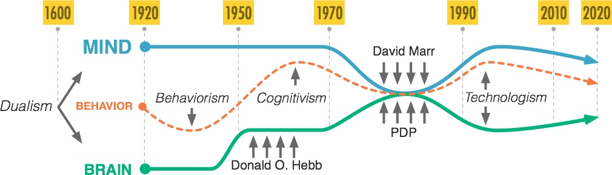

# Behavioral-Neuroscience-for-Rational-Minds #

## Course description ##

The main goal of the course is to support students in the development of the mindset necessary to (i) design unbiased experiments and (ii) obtain reproducible results in behavioral neuroscience. To this end, the course will take advantage of a modern framework derived from the field of artificial intelligence to rationalize and operationalize complex concepts in behavioral neuroscience.

